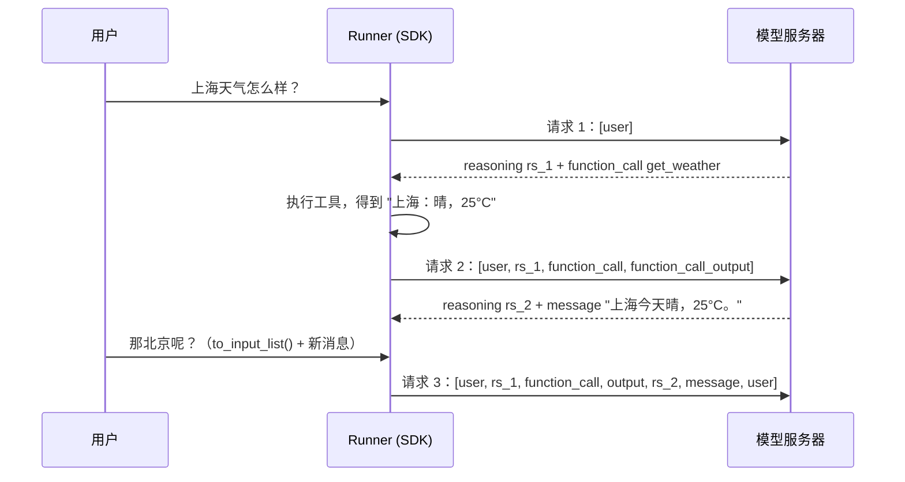

# 第 01 课：reasoning 会留在轨迹里吗？

> **问题**：推理模型每一步通常先输出 reasoning（思维链），再输出工具调用或回答。在 OpenAI Agents SDK 里，这些 reasoning 默认会不会保留在轨迹（trajectory）中？当 SDK 把工具结果送回模型、或者用户发来下一条消息时，上一步的 reasoning 会不会出现在下一步解码的上下文里？

配套材料：

- [`probe_reasoning_replay.py`](probe_reasoning_replay.py)：不需要 API key 和 GPU 的验证脚本，打印 SDK 每一步真实发出的请求体。
- [`reasoning-flow.html`](reasoning-flow.html)：交互式图解，可以切换 "API 形态 × 后端模型 × 第几步"，看 reasoning 在每一层是保留还是丢弃。在线版本：[Reasoning 会留在轨迹里吗](https://claude.ai/artifact/AZoUjicu7Pm5qXjAZ4GVQB)（私有链接，需要所有者分享后他人才能打开）。

源码版本：Agents SDK `f9da374`，vLLM `8a23646`。

## 一句话回答

**SDK 默认会保留，并且原样回传；但 "回传了" 不等于 "模型看得到"。** reasoning 要真正变成下一步解码时的 prompt token，需要依次通过三层：

1. **SDK 层（客户端组装请求）**：`Runner` 把每一步产生的 `ReasoningItem` 放进轨迹，下一步请求时原样拼回去。同一用户回合内的工具回传如此，你用 `result.to_input_list()` 或 Session 开启下一个用户回合时也如此。唯一需要注意的例外是 Chat Completions 适配器，它会按字段名决定回不回传。
2. **服务器层（解析请求）**：OpenAI 平台由 `reasoning.context` 决定是否渲染早先回合的 reasoning。vLLM 的通用路径不做裁剪，把 reasoning 原样交给 chat template；gpt-oss（Harmony）和 DeepSeek V3.2/V4 等少数模型由 vLLM 自己裁剪。
3. **模板层（渲染成 token）**：大多数开源推理模型的 chat template（Qwen3、MiniMax-M2、Gemma 4 默认配置、DeepSeek V3.2）只渲染 "最后一条真实用户消息之后" 的 reasoning。

对 Qwen3 + vLLM + Agents SDK 这条最常见的组合，最终效果是：

| 场景 | reasoning 会出现在下一步的 prompt 里吗？ |
| --- | --- |
| 同一个用户回合内，工具结果回传后的下一步 | **会**（interleaved thinking，模型接着自己的思路继续） |
| 下一个用户回合 | **不会**（模板把之前回合的 `<think>` 删掉了） |

## 0. 先统一几个词

- **步（step）**：一次模型请求 + 一次解码。SDK 源码里叫 turn，例如 `max_turns` 限制的就是步数。
- **用户回合（user turn）**：从一条用户消息开始，到 agent 给出最终回答为止。一个用户回合可能包含多步，因为中间可能有多轮工具调用。
- **轨迹（trajectory）**：SDK 里就是 `RunItem` 列表（`result.new_items`），包括 `ReasoningItem`、`ToolCallItem`、`ToolCallOutputItem`、`MessageOutputItem` 等。

本课的例子贯穿始终：用户问 "上海天气怎么样？"，模型思考后调用 `get_weather`，拿到结果后回答；接着用户追问 "那北京呢？"。



## 1. SDK 层：Runner 如何组装下一步的输入

### 1.1 reasoning 先变成 `ReasoningItem`

模型返回后，`src/agents/run_internal/turn_resolution.py:3182` 把每个 `ResponseReasoningItem` 包装成 `ReasoningItem`（定义在 `src/agents/items.py:493`），和工具调用、消息一起进入本次 run 的 `generated_items`。

### 1.2 下一步请求 = 原始输入 + 全部已生成条目

非流式循环在 `src/agents/run_internal/run_loop.py:2521`，流式循环在 `run_loop.py:2203`，两者都调用同一个函数：

```python
# src/agents/run_internal/run_loop.py:340
def _prepare_turn_input_items(caller_input, generated_items, reasoning_item_id_policy):
    caller_items = ItemHelpers.input_to_new_input_list(caller_input)
    continuation_items = run_items_to_input_items(generated_items, reasoning_item_id_policy)
    return prepare_model_input_items(caller_items, continuation_items)
```

`run_items_to_input_items` 逐个调用 `run_item_to_input_item`（`src/agents/run_internal/items.py:139`）。这个函数只跳过 `tool_approval_item`，**不会过滤 reasoning**。唯一和 reasoning 有关的逻辑是：当 `reasoning_item_id_policy="omit"` 时去掉 reasoning 的 `id` 字段，内容仍然保留。

`prepare_model_input_items`（`items.py:331`）随后调用 `drop_orphan_function_calls`（`items.py:171`）。它只会在一种情况下删除 reasoning：某个工具调用没有对应的输出（例如中断后恢复），这个调用被删掉时，紧挨在它前面的 reasoning 也一起删掉，否则 Responses API 会报 `Item 'rs_...' of type 'reasoning' was provided without its required following item`。

### 1.3 下一个用户回合：取决于你怎么把历史带过去

| 你的做法 | reasoning 是否在历史里 |
| --- | --- |
| `result.to_input_list() + [新消息]` | 在（`src/agents/result.py:435`，同样走 `run_item_to_input_item`） |
| 使用 `Session` | 在（`save_result_to_session`，`src/agents/run_internal/session_persistence.py:699`，同样走 `run_item_to_input_item`） |
| `previous_response_id` / `conversation_id` / `auto_previous_response_id` | 历史保存在服务器上，SDK 只发送新增条目；能不能看到旧 reasoning 由服务器决定（见第 3 节） |
| handoff 时使用 `handoff_filters.remove_all_tools` | 不在（`src/agents/extensions/handoff_filters.py:59` 会连同 `ReasoningItem` 一起删掉） |

### 1.4 用脚本亲眼看一下

运行 `uv run python tutorial/01-reasoning-in-trajectory/probe_reasoning_replay.py`，场景 A（Responses API）的输出：

```text
--- 请求 2：返回工具结果后（同一用户回合内） ---
  user      message         上海天气怎么样？
  assistant reasoning (rs_1)  用户问上海天气，我需要调用 get_weather。
  assistant function_call   get_weather({"city": "上海"})
  tool      function_call_output  上海：晴，25°C

--- 请求 3：下一个用户回合 ---
  user      message         上海天气怎么样？
  assistant reasoning (rs_1)  用户问上海天气，我需要调用 get_weather。
  assistant function_call   get_weather({"city": "上海"})
  tool      function_call_output  上海：晴，25°C
  assistant reasoning (rs_2)  工具返回晴 25°C，可以直接回答。
  assistant message         上海今天晴，25°C。
  user      message         那北京呢？
```

可以看到，在 SDK 层，**所有** reasoning 都被带到了后续请求里，包括上一个用户回合的 `rs_1` 和 `rs_2`。

## 2. 模型适配器：Responses 与 Chat Completions 不一样

轨迹在 SDK 内部统一用 Responses API 的 item 格式表示。真正发请求前，模型适配器会再做一次转换。

### 2.1 `OpenAIResponsesModel`：基本原样发送

Responses API 本身就有 `{"type": "reasoning"}` 这种输入 item，所以适配器基本原样发送。唯一的处理在 `_clean_item_for_openai`（`src/agents/models/openai_responses.py:1105`）：带 `provider_data` 的 reasoning item 会被删除。这类 item 来自 Chat Completions 或 LiteLLM 等其他适配器，常见于 handoff 时换了模型。

### 2.2 `OpenAIChatCompletionsModel`：按字段名决定

Chat Completions 协议里没有标准的 reasoning 字段，各家服务器各用各的。SDK 的转换逻辑在 `src/agents/models/chatcmpl_converter.py`：

**读取响应时**（`message_to_output_items`，第 123 行）：

- 响应里有 `message.reasoning`（新版 vLLM、OpenRouter 等）→ 存进 `ReasoningItem.content`，并在 `provider_data` 里记下 "来自 `reasoning` 字段" 以及生成它的模型名。
- 响应里有 `message.reasoning_content`（旧版 vLLM、DeepSeek 官方 API 等）→ 存进 `ReasoningItem.summary`。

**组装下一次请求时**（`items_to_messages`，第 534 行；reasoning 分支在第 911 行）：

- 来自 `reasoning` 字段，且当前模型名与生成它的模型名相同（第 927 行）→ 回传为 assistant 消息的 `reasoning` 字段。
- 来自 `reasoning_content` 字段 → 由 `should_replay_reasoning_content` 钩子决定。默认实现（`src/agents/models/reasoning_content_replay.py:41`）只在模型名包含 `deepseek` 时回传，其余情况**直接丢弃**。

验证脚本的场景 B、C、D 对应这三种情况：

```text
B. 服务器返回 message.reasoning（新版 vLLM 字段），默认配置
--- 请求 2 ---
  assistant reasoning='用户问上海天气，我需要调用 get_weather。', tool_call=get_weather

C. 服务器返回 message.reasoning_content（旧字段），默认配置
--- 请求 2 ---
  assistant tool_call=get_weather                ← reasoning 在 SDK 层就被丢了

D. 同 C，但设置 should_replay_reasoning_content=lambda ctx: True
--- 请求 2 ---
  assistant reasoning_content='用户问上海天气，我需要调用 get_weather。', tool_call=get_weather
```

> **坑**：如果你的 vLLM 版本较旧，响应字段还叫 `reasoning_content`，而模型名又不含 `deepseek`（比如 `Qwen/Qwen3-8B`），那么 SDK 默认会把 reasoning 丢掉，连同一用户回合内的 interleaved thinking 也没有了。升级 vLLM，或者给 `OpenAIChatCompletionsModel` 传 `should_replay_reasoning_content` 钩子。

## 3. 服务器层：请求到了服务器之后

### 3.1 OpenAI 平台（Responses API）

即使 SDK 把所有 reasoning item 都发过去，OpenAI 服务器也会根据 `reasoning.context` 决定渲染哪些。以下引用自 OpenAI 的 reasoning 指南和 `openai` Python 包的类型注释：

- `current_turn`："Makes reasoning from the active turn available, but does not render reasoning from earlier turns into the next sample."
- `all_turns`："Renders available, compatible reasoning items from earlier turns into the next sample."
- 默认值（`auto` 或不传）：GPT-5.6 系列默认 `all_turns`，更早的模型默认 `current_turn`。

OpenAI 还建议，在函数调用循环中，把 "自最后一条 user 消息以来" 的 reasoning、function_call、function_call_output 全部回传。SDK 的默认行为已经满足这一点。

另外两个相关参数：`store` 默认为 `true`，服务器会保存响应，回传的 reasoning item 可以通过 `id`（如 `rs_...`）对应到服务器上保存的内容；当 `store=false` 或组织启用了零数据保留（无状态模式）时，服务器没有保存，需要靠 reasoning item 里的 `encrypted_content` 把 reasoning 带回去。在 SDK 里可以用 `ModelSettings(store=False, response_include=["reasoning.encrypted_content"])`。

### 3.2 vLLM：Chat Completions（`/v1/chat/completions`）

以下路径均位于 vLLM 仓库。

1. **输入字段归一化**：`vllm/entrypoints/openai/chat_completion/protocol.py:522` 的 `_normalize_messages_before` 把旧字段 `reasoning_content` 改名为 `reasoning`。两个字段都有时，`reasoning` 优先。
2. **交给模板时两个名字都给**：`vllm/entrypoints/chat_utils.py:2006` 的 `_parse_chat_message_content` 只对 assistant 消息处理 reasoning，并同时设置 `reasoning` 和 `reasoning_content`（第 2039 行注释："Include reasoning if present for interleaved thinking"）。所以只认 `reasoning_content` 的 Qwen3 模板也能读到 SDK 发来的 `reasoning`。
3. **不做裁剪**：通用 HF 渲染路径直接调用 `tokenizer.apply_chat_template`，是否渲染完全由模板决定。
4. **输出字段**：响应里只有 `reasoning`（`protocol.py:72`）。vLLM 文档 `docs/features/reasoning_outputs.md` 明确说明 `reasoning` 以前叫 `reasoning_content`。
5. **由 vLLM 自己裁剪的例外**：
   - DeepSeek V3.2：`vllm/tokenizers/deepseek_v32.py:42`，`drop_thinking = messages[-1]["role"] == "user"`，即新用户消息到来时丢弃历史 reasoning。
   - DeepSeek V4：默认 `drop_thinking=True`，但 `vllm/tokenizers/deepseek_v4_encoding.py` 中有 "if any message has tools defined, don't drop thinking" 的逻辑，所以带工具的 agent 请求会**保留**全部历史 reasoning。
   - gpt-oss：走 Harmony 渲染，见 3.4。

vLLM 自己的文档 `docs/features/interleaved_thinking.md:90` 也演示了在工具调用后把 `"reasoning": response.choices[0].message.reasoning` 放回 assistant 消息。

### 3.3 vLLM：Responses API（`/v1/responses`）

- **客户端发来的 reasoning item**：`vllm/entrypoints/openai/responses/utils.py:273` 把它转成 assistant 消息的 `reasoning` 字段（优先取 `content[0].text`，没有时退回 `summary[0].text` 并打警告），之后和 Chat Completions 走同一条模板路径。
- **`encrypted_content` 不支持**：带 `encrypted_content` 的 reasoning item 会被拒绝，报错 "Encrypted content is not supported."。vLLM 自己返回的 reasoning item 不含 `encrypted_content`，所以 SDK 原样回传没有问题。
- **`store` / `previous_response_id`**：vLLM 默认忽略 `store`，只有设置 `VLLM_ENABLE_RESPONSES_API_STORE=1` 才会把消息存在内存里（`vllm/envs.py:1885`，注释说明这会导致内存泄漏）。即使开启，非 Harmony 路径用 `previous_response_id` 回放上一轮输出时，也只追加 `ResponseOutputMessage` 的文本（`utils.py:187` 注释："NOTE: We skip the reasoning output."）。
- **建议**：配合 vLLM 时，让 SDK 发送完整历史（默认行为），不要依赖 `previous_response_id`。

### 3.4 vLLM：gpt-oss（Harmony 格式）

gpt-oss 不使用 Jinja 模板，而由 vLLM 转成 Harmony 消息后渲染：

- `vllm/entrypoints/openai/parser/harmony_utils.py:352` 把 assistant 消息上的 `reasoning` 转成 `analysis` 频道消息。
- `harmony_utils.py:230` 的 `auto_drop_analysis_messages`：找到最后一条发往 `final` 频道的 assistant 消息，删除它之前的所有 `analysis` 消息。
- `harmony_utils.py:449` 的 `render_for_completion` 先调用上面的函数，再以 `auto_drop_analysis=False` 调用 openai-harmony 库渲染。

效果和 "当前回合" 规则基本一致：工具调用循环中（最后一个 final 之后）的 analysis 被保留，已经给出 final 回答的回合的 analysis 被删除。

## 4. 模板层：最终进入模型的 token

以 Qwen3-8B 的官方 chat template 为例。模板先倒序找到 `last_query_index`（最后一条不是 `<tool_response>` 的用户消息），然后只对这个位置之后的 assistant 消息渲染 `<think>`：

```jinja

    
        {{- '<|im_start|>' + message.role + '\n<think>\n' + reasoning_content.strip('\n') + '\n</think>\n\n' + content.lstrip('\n') }}
    ...

    {{- '<|im_start|>' + message.role + '\n' + content }}
```

把验证脚本场景 B 的请求体按 vLLM 的方式处理（`reasoning` 复制为 `reasoning_content`）后套用这个模板（为了简洁，省略了工具定义部分）：

**请求 2（同一用户回合内）**：上一步的思考保留了。

```text
<|im_start|>system
你是天气助手。<|im_end|>
<|im_start|>user
上海天气怎么样？<|im_end|>
<|im_start|>assistant
<think>
用户问上海天气，我需要调用 get_weather。
</think>

<tool_call>
{"name": "get_weather", "arguments": {"city": "上海"}}
</tool_call><|im_end|>
<|im_start|>user
<tool_response>
上海：晴，25°C
</tool_response><|im_end|>
<|im_start|>assistant
```

**请求 3（下一个用户回合）**：SDK 发送了 `rs_1` 和 `rs_2`，但模板把它们都删掉了。

```text
<|im_start|>system
你是天气助手。<|im_end|>
<|im_start|>user
上海天气怎么样？<|im_end|>
<|im_start|>assistant
<tool_call>
{"name": "get_weather", "arguments": {"city": "上海"}}
</tool_call><|im_end|>
<|im_start|>user
<tool_response>
上海：晴，25°C
</tool_response><|im_end|>
<|im_start|>assistant
上海今天晴，25°C。<|im_end|>
<|im_start|>user
那北京呢？<|im_end|>
<|im_start|>assistant
```

不同模型的策略并不相同：

| 模型 / 后端 | 跨用户回合的旧 reasoning | 决定者 |
| --- | --- | --- |
| Qwen3、MiniMax-M2 | 丢弃（只保留最后一条用户消息之后的） | HF chat template |
| Gemma 4（vLLM 示例模板） | 默认丢弃；`chat_template_kwargs={"preserve_thinking": true}` 时保留 | `examples/tool_chat_template_gemma4.jinja:236` |
| DeepSeek V3.2 | 丢弃 | vLLM 内置编码器 |
| DeepSeek V4 | 默认丢弃；请求带工具时保留 | vLLM 内置编码器 |
| Cohere（vLLM 渲染器） | 保留 | `vllm/renderers/cohere.py` |
| gpt-oss（vLLM Harmony） | 丢弃最后一个 `final` 之前的 `analysis` | vLLM `auto_drop_analysis_messages` |
| OpenAI GPT-5.6 | 默认保留（`all_turns`） | OpenAI 服务器 |
| 更早的 OpenAI 推理模型 | 默认丢弃（`current_turn`） | OpenAI 服务器 |

MiniMax-M2 的模型卡强调 "必须在历史中保留 `<think>...</think>`"，而它的模板同样只渲染最后一条用户消息之后的 reasoning。这两件事并不矛盾：**客户端负责完整回传，模板负责按训练时的格式取舍**。客户端自己提前删掉，模板就没有东西可以渲染了。

## 5. 为什么这样设计：harness 视角

- **回合内保留**：工具调用循环中，模型在调用工具前已经想好了计划。保留这段思考，模型可以接着计划往下走，不必在每次工具返回后从头推理一遍。OpenAI 的指南和 vLLM 的 interleaved thinking 文档都是这个意思。
- **跨回合丢弃**：旧回合的思考已经体现在最终回答里，再保留只会占用上下文。更重要的是，模型训练时看到的多轮数据就是这种格式，模板描述的正是训练分布。
- **SDK 只负责 "不丢"**：harness 不知道下游是哪个模型、哪个模板，所以最稳妥的做法是把完整轨迹交给服务器，由最了解模型的一方（服务器或模板）裁剪。Chat Completions 的字段检查是一个例外，因为这个协议没有标准字段，SDK 不确定把 reasoning 放进哪个字段才安全。

### 一个容易忽略的代价：前缀缓存

请求 2 的 prompt 里，第一条 assistant 消息以 `<think>` 开头；到了请求 3，同一位置变成了 `<tool_call>`。prompt 从这里开始和上一次不同，所以 vLLM 的前缀缓存（prefix caching）只能命中这个位置之前的部分。在每一个新用户回合，模板删除旧 reasoning 都会让缓存从第一条被改写的 assistant 消息开始失效。vLLM 的 `docs/features/nixl_connector_usage.md:313` 在 P/D 分离场景下专门警告过这个问题："If the client strips thinking traces from the conversation history before sending the next turn, the prompt P receives will be missing tokens from the middle of what D generated"。

## 6. 你可以控制的开关

| 想要的效果 | 做法 |
| --- | --- |
| 保留 reasoning 内容，但去掉 `rs_...` ID（规避 "without its required following item" 400 错误） | `RunConfig(reasoning_item_id_policy="omit")` |
| 在客户端只保留当前用户回合的 reasoning | `RunConfig(call_model_input_filter=...)`，示例见下方，也是验证脚本的场景 E |
| Chat Completions 下强制回传 `reasoning_content` | `OpenAIChatCompletionsModel(..., should_replay_reasoning_content=lambda ctx: True)` |
| handoff 时不把 reasoning 交给下一个 agent | `handoff(..., input_filter=handoff_filters.remove_all_tools)` |
| OpenAI 上控制跨回合 reasoning | `ModelSettings(reasoning=Reasoning(context="current_turn" 或 "all_turns"))`（仅 Responses API） |
| OpenAI 无状态调用（`store=False`） | `ModelSettings(store=False, response_include=["reasoning.encrypted_content"])` |
| vLLM 上让模板保留历史 reasoning | `extra_body={"chat_template_kwargs": {...}}`，前提是模板支持对应参数，例如 Gemma 4 的 `preserve_thinking` |

在客户端模拟 `current_turn` 的过滤器：

```python
from typing import Any

from agents import RunConfig
from agents.run import CallModelData, ModelInputData


def keep_only_current_turn_reasoning(data: CallModelData[Any]) -> ModelInputData:
    items = data.model_data.input
    user_indexes = [
        i for i, item in enumerate(items) if isinstance(item, dict) and item.get("role") == "user"
    ]
    last_user_index = user_indexes[-1] if user_indexes else -1
    kept = [
        item
        for i, item in enumerate(items)
        if not (isinstance(item, dict) and item.get("type") == "reasoning" and i < last_user_index)
    ]
    return ModelInputData(input=kept, instructions=data.model_data.instructions)


run_config = RunConfig(call_model_input_filter=keep_only_current_turn_reasoning)
```

注意，`call_model_input_filter` 只影响发给模型的请求，不会改变 `result.new_items` 或 Session 里保存的轨迹。

## 7. 小结

1. Agents SDK 把 reasoning 当作轨迹的一等公民：保存、回传、持久化，默认不删。
2. Chat Completions 是例外：SDK 只自动回传 `reasoning` 字段（同模型），`reasoning_content` 默认只对 DeepSeek 回传。
3. 模型最终看到什么，由服务器（OpenAI 的 `reasoning.context`、vLLM 的 Harmony 和 DeepSeek 编码器）或 chat template 决定。主流开源模型的规则是 "回合内保留，跨回合丢弃"。
4. 调试时要分清三层：看 SDK 发了什么（本课脚本，或开启 debug 日志），看服务器怎么解析，再看模板渲染出了什么（`tokenizer.apply_chat_template`，或者用 `vllm serve <model> --enable-scale-out` 启动后调用 `/v1/chat/completions/render`）。

## 思考题

1. 如果你在客户端（例如用 `call_model_input_filter`）把所有 reasoning 都删掉，Qwen3 在工具调用循环中的表现可能会怎样变化？对前缀缓存又有什么影响？
2. 用 `previous_response_id` 连接 vLLM 的 Responses API 时，上一轮的 reasoning 去哪了？和让 SDK 发送完整历史相比有什么区别？
3. GPT-5.6 默认 `all_turns`。如果一个 agent 先用 GPT-5.6，再 handoff 给一个通过 Chat Completions 接入的开源模型，reasoning item 在交接时会经历什么？（提示：看 `chatcmpl_converter.py` 第 927 行的模型名检查。）
