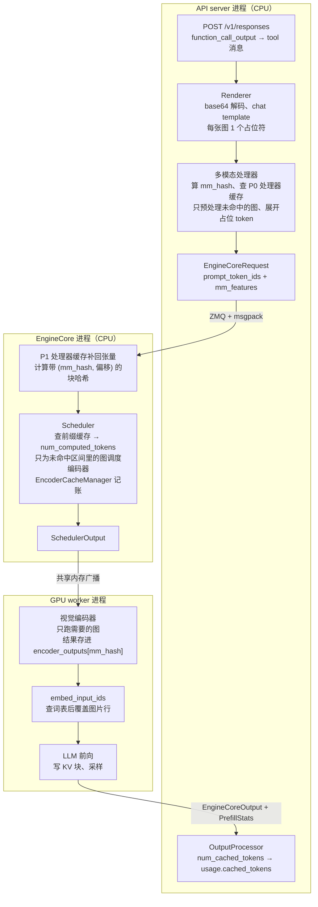

# 第 02 课：截图进入上下文之后

> **问题**：用 OpenAI Agents SDK 搭一个 computer-use agent（CUA），工具 schema 由我们自己设计，让 Qwen/Qwen3.8-2.4T-A95B、moonshotai/Kimi-K3、deepseek-ai/DeepSeek-V4.1-Flash 这样的新模型通过 vLLM 来驱动。当轨迹里有好几步、其中一些步骤的工具结果是截图时：
>
> 1. 上下文长什么样？
> 2. 图片是怎么变成嵌入的？它和文本 token 的嵌入是一回事吗？
> 3. 缓存是什么样的，怎样才能命中多模态缓存？
> 4. vLLM 的 Responses API 返回了什么，能不能知道缓存命中了多少？
> 5. 在服务端引擎里，这样一个多模态 agent 是什么样子？

配套材料：

- [`probe_cua_context.py`](probe_cua_context.py)：不需要 API key 和 GPU 的验证脚本。它运行一个用自定义工具返回截图的 agent，打印 SDK 每一步真正发给服务器的请求体。
- [`screenshot-in-vllm.html`](screenshot-in-vllm.html)：交互式图解。可以切换模型、截图分辨率和 harness 策略，按比例看每一次请求的上下文、前缀缓存命中和编码器调度。

源码版本：Agents SDK `bc3596a`，vLLM `8a23646`。下文的 `src/agents/...` 路径属于本仓库，`vllm/...` 路径属于 vLLM 仓库。

## 一句话回答

- **上下文**：SDK 每一步都把完整历史重新发送，第 k 次请求带着前面 k−1 张截图。每张截图在 prompt 里是一段占位 token，数量由分辨率决定：1920×1080 的截图在 Kimi-K3 上是 2,691 个，在 DeepSeek-V4.1-Flash 上是 968 个。Qwen3.8-2.4T-A95B 是纯文本模型，根本收不了截图。
- **嵌入**：占位位置的 token id 都一样，它们的输入向量不是从词表查出来的，而是视觉编码器（ViT + 投影层）输出的连续向量，在进入 LLM 之前覆盖到这些位置上。之后 LLM 对这些位置的处理和文字完全一样，也会算 K/V、占 KV cache、计入 `input_tokens`。
- **缓存**：有三层，键都基于图片的哈希（`mm_hash`）。处理器缓存省掉图片预处理，编码器缓存省掉 ViT 前向，KV 前缀缓存省掉整段 prefill。只要历史只追加不改写，旧截图会落在前缀命中区间里，连视觉编码器都不会被调度。
- **Responses API**：`usage.input_tokens_details.cached_tokens` 总会返回，表示 KV 前缀缓存命中的 token 数（包括旧截图的占位 token）。处理器缓存和编码器缓存的命中只能在服务端指标和日志里看到。
- **引擎视图**：API server 进程负责解码图片、算哈希、查处理器缓存、展开占位 token；EngineCore 进程的调度器查前缀缓存和编码器缓存，决定哪些截图要跑视觉编码器；GPU worker 跑视觉编码器、覆盖嵌入、跑 LLM、写 KV 块。

## 1. 先看模型：谁能看截图

| 模型 | vLLM 中的架构 | 能收图片吗 | 1280×720 / 1920×1080 的图片 token | 注意力结构 |
| --- | --- | --- | --- | --- |
| Qwen3.8-2.4T-A95B | `Qwen3_5MoeForCausalLM`（文本生成模型） | **不能** | — | 69 层 Gated DeltaNet + 23 层全注意力（3:1 混合） |
| Kimi-K3 | `KimiK3ForConditionalGeneration` | 能（MoonViT，patch 14，2×2 合并） | 1,196 / 2,691（另加 9～10 个包装 token） | 69 层 KDA 线性注意力 + 24 层 MLA（混合） |
| DeepSeek-V4.1-Flash | `DeepseekV41ForCausalLM`（vLLM 中注册为多模态） | 能（DeepSeek ViT，patch 14，3×3 下采样） | 578 / 968（上限 1,024） | 128 token 滑动窗口 + 压缩稀疏 MLA |

- **Qwen3.8-2.4T-A95B**：`config.json` 里没有 `vision_config`，README 写明 “Multimodal inputs are not supported”；它的 chat template 遇到非文本内容会抛出 `Unexpected item type in content.`；在 vLLM 里给纯文本模型发图片会得到 `... is not a multimodal model`（HTTP 400）。要么给它文字观察（可访问性树、OCR），要么换同系列带视觉的 Qwen3.8-27B（`Qwen3_5ForConditionalGeneration`）。
- **Kimi-K3**：启动时需要 `--trust-remote-code`（分词器和图片处理器来自模型仓库）。token 数 = ⌈H/28⌉ × ⌈W/28⌉（不超过 65,536 个 patch、每边不超过 512 个 patch 时不缩放，只补边到 28 的倍数，见 `vllm/models/kimi_k3/common/mm_preprocess.py`）。每张图写成 `<|media_begin|>image 1920x1080<|media_content|>` + 2,691 × `<|media_pad|>` + `<|media_end|>`，只有 `<|media_pad|>`（id 163605）的位置被视觉向量覆盖；起止标记和 `image 1920x1080` 这段文字仍然查词表，而且文字用的是原始分辨率，不同分辨率的截图连这几个普通 token 也不同。
- **DeepSeek-V4.1-Flash**：先补边到 14 的倍数，网格 = ⌈(H/14)/3⌉ × ⌈(W/14)/3⌉，token 数 = 行 × (列 + 1) + 2（每行末尾一个换行位置，首尾各一个）。超过 1,024 时按比例缩小：1920×1080 先缩到 1708×966，得到 23 × 41 网格、968 个 token（`vllm/models/deepseek_v41/common/mm_preprocess.py:71`）。所有位置的 id 都是 129264，连起止和换行位置的向量也来自视觉部分，而不是词表。

## 2. Harness 侧：截图在 SDK 里是什么

### 2.1 为什么不用内置的 `ComputerTool`

SDK 内置的 `ComputerTool`（`src/agents/tool.py`）是 Responses API 的托管工具：模型必须输出 OpenAI 定义的 `computer_call` 条目，SDK 才会去执行动作并回传 `computer_call_output`。vLLM 上的开源模型只会产生普通的函数调用，vLLM 的 Responses 服务也只把函数工具渲染进 chat template；在 Chat Completions 适配器上，托管工具会直接报错 `Hosted tools are not supported with the ChatCompletions API`。所以本课用普通函数工具实现自己的 schema。

### 2.2 自定义工具返回截图

```python
from agents import ToolOutputImage, ToolOutputText
from agents.decorators import tool


@tool
def click(x: int, y: int) -> list[ToolOutputText | ToolOutputImage]:
    """在屏幕坐标 (x, y) 处单击，返回点击后的截图。"""
    desktop.click(x, y)
    return [
        ToolOutputText(text=f"已点击 ({x}, {y})"),
        ToolOutputImage(image_url=desktop.screenshot_data_url(), detail="auto"),
    ]
```

SDK 把返回值转换成 Responses 格式的 `function_call_output`，`output` 是内容列表：`ToolOutputText` 变成 `{"type": "input_text"}`，`ToolOutputImage` 变成 `{"type": "input_image", "image_url": ..., "detail": ...}`（`src/agents/items.py:1003`）。

> **坑：列表里的每个元素都必须是结构化输出。** 只有当列表中所有元素都是 `ToolOutputText` / `ToolOutputImage` / `ToolOutputFileContent`（或带 `type` 的等价 dict）时，SDK 才会把它当作内容列表（`src/agents/items.py:965`）。如果写成 `["已点击", ToolOutputImage(...)]`，整个列表会被 `str()` 成一段文字，base64 会作为普通文本 token 发给模型。文字部分请用 `ToolOutputText`。

> **坑：一定要设置 `detail`。** SDK 只在 `detail` 不为空时才发送这个字段。vLLM 只给 user 消息 `content` 里的图片补默认值 `detail="auto"`（`vllm/entrypoints/openai/responses/protocol.py:139`），工具结果 `output` 里的图片不会补；而 vLLM 解析 `input_image` 时用 `ResponseInputImageParam` 校验，其中 `detail` 是必填字段（`vllm/entrypoints/chat_utils.py:1639`）。缺少 `detail` 的截图会导致校验失败、请求返回 400。vLLM 并不使用 `detail` 的取值（不影响缩放和 token 数），所以设成 `"auto"` 即可。

### 2.3 Responses 与 Chat Completions 的差别

运行 `uv run python tutorial/02-cua-multimodal-context/probe_cua_context.py`，4 次请求的结果（节选）：

```text
A. Responses API，默认配置
--- 请求 4 ---
  user      message               '在浏览器的搜索框里输入 vLLM 并回车。'
  assistant function_call         screenshot({})
  tool      function_call_output  [图片 S1]
  assistant function_call         click({"x": 640, "y": 88})
  tool      function_call_output  '已点击 (640, 88)' + [图片 S2]
  assistant function_call         type_text({"text": "vLLM\n"})
  tool      function_call_output  "已输入 'vLLM\\n'" + [图片 S3]
  请求 4 以请求 3 的全部 5 条输入为前缀：是

B. Chat Completions，默认配置
--- 请求 4 ---
  assistant tool_call screenshot({})
  tool      '[tool output omitted]'
  assistant tool_call click({"x": 640, "y": 88})
  tool      '已点击 (640, 88)'                ← 截图被静默删除

C. Chat Completions，用 call_model_input_filter 把截图挪到 user 消息
  tool      '已点击 (640, 88)'
  user      [图片 S2]

D. Responses API，用 call_model_input_filter 只保留最近一张截图
  tool      function_call_output  '[旧截图已省略]'
  请求 4 以请求 3 的输入为前缀：否，第 5 条开始不同
```

- **Responses API（推荐）**：每张截图都留在对应的 `function_call_output` 里，请求之间只追加。vLLM 把 `function_call_output` 原样转成 `role="tool"` 消息（`vllm/entrypoints/openai/responses/utils.py:317`），其中的图片照常解析。
- **Chat Completions 默认**：`OpenAIChatCompletionsModel` 调用 `items_to_messages` 时没有打开 `preserve_tool_output_all_content`（`src/agents/models/openai_chatcompletions.py:621`），工具结果里的图片被丢弃。只有图片时替换成 `[tool output omitted]`（`src/agents/models/chatcmpl_converter.py:76`）并记录警告，图文混合时只剩文字。模型实际上是“盲”的。
- **Chat Completions + 过滤器**：`call_model_input_filter` 把截图挪进紧随其后的 user 消息，user 消息里的图片会保留，前缀也保持稳定。（对 DeepSeek-V4.1 来说两种写法差别不大：它的编码器本来就把 tool 结果并入 user 回合，紧随其后的 user 消息也会合并进同一个回合。）
- **只保留最近 N 张**：上下文长度不再增长，但每次都会改写上一张截图的位置，前缀缓存从那里断开（见第 4 节）。

### 2.4 每个模型的 reasoning effort 取值不同

通过 `ModelSettings(reasoning=Reasoning(effort=...))` 设置的值，vLLM 会作为 chat template 参数传给模型，各模型接受的取值不同：Qwen3.8 只接受 `low` / `medium` / `xhigh`（传 `high` 会报错，而且不能关闭思考）；Kimi-K3 接受 `low` / `high` / `max`，`none` 表示关闭思考；DeepSeek-V4.1 接受 `low` / `high` / `xhigh` / `max` 或 1～100 的整数，`none` 切换到非思考模式。

### 2.5 SDK 不会替你裁剪截图

每一次模型调用，Runner 都从原始输入加上全部已生成条目重新构造输入（`src/agents/run_internal/run_loop.py:2521`），`call_model_input_filter` 只影响这一次请求，不改变 `result.new_items` 或 Session。持久化时要注意体积：`RunState.to_string()` 里每张截图的 base64 会出现 4 次（`generated_items` 和 `session_items` 各自的 `raw_item` 与 `output`），`SQLiteSession` 也保存完整 base64。`ModelSettings.truncation`、`context_management` 和 `OpenAIResponsesCompactionSession` 都是面向 OpenAI 平台的功能：vLLM 没有 compact 接口；`truncation="auto"` 在 vLLM 里只按 token 截断，而且如果截断会切到图片，vLLM 会直接拒绝请求，不会像 OpenAI 那样丢掉旧条目。

另外，`previous_response_id` / `auto_previous_response_id` 在默认配置的 vLLM 上不可用：SDK 只发送增量，而 vLLM 默认不保存响应（需要设置 `VLLM_ENABLE_RESPONSES_API_STORE=1`，且只存在内存里），下一次请求会因为找不到上一个响应而返回 404。让 SDK 每次发送完整历史是更稳妥的做法。

## 3. 截图在 vLLM 里变成什么

### 3.1 从请求到 token 序列

1. **解析**：`input_image` 与 `image_url` 共用一个解析器（`vllm/entrypoints/chat_utils.py:1653`）。data URL 必须是 base64，在线程池里解码后由 PIL 打开（`VLLM_IMAGE_FETCH_TIMEOUT` 只作用于 HTTP 图片地址，对 data URL 无效）；原始字节会被保留下来用于计算哈希。
2. **渲染**：每个模型用自己的渲染器。Kimi-K3 用 `KimiK3Renderer` 和官方的 `encoding_k3` 编码器，图片先变成字符串占位符 `<|kimi_image_placeholder|>`；DeepSeek-V4.1 用 Python 编码器，把每张图变成 `<｜deepseek_image｜>`，并把 tool 消息并入 user 回合的 `<tool_result>` 块。此时每张图只有 1 个占位符。
3. **展开**：多模态处理器运行图片预处理，然后把 1 个占位符替换成 N 个占位 token（`vllm/multimodal/processing/processor.py` 中的 `PromptReplacement`），并记录每张图的 `PlaceholderRange(offset, length, is_embed)`。（细节：Kimi-K3 的 `<|kimi_image_placeholder|>` 不是特殊 token，后面紧跟换行时会和换行合并成一个 BPE token，token 级匹配失败，vLLM 会退回到“解码整段 prompt、做文本替换、再重新编码”的路径。这一点来自代码阅读和离线分词复现，没有在真实服务上验证。）
4. **送进引擎**：`EngineCoreRequest` 携带展开后的 `prompt_token_ids` 和按位置排序的 `mm_features`（每张图一个：`mm_hash`、位置区间、预处理后的张量；处理器缓存命中时张量为空）。

### 3.2 嵌入：不是查词表

```python
# vllm/model_executor/models/interfaces.py:511 附近（节选）
inputs_embeds = self._embed_text_input_ids(input_ids, ...)   # 先对所有 id 查词表
...
# vllm/model_executor/models/utils.py:723
inputs_embeds[is_multimodal] = mm_embeds_flat                # 再用视觉编码器的输出覆盖图片位置
```

- 文本 token 的输入向量来自词表嵌入矩阵的一行，同一个 id 永远得到同一个向量。
- 图片位置的 id 只是占位符，同一模型的所有截图共用一个 id。真正的内容来自 `embed_multimodal`：ViT 把 14×14 像素的 patch 编码成向量，相邻 patch 被合并（Kimi 2×2，DeepSeek 3×3），再经过投影层变成 LLM 的隐藏维度（Kimi-K3 是 7,168，DeepSeek-V4.1 是 5,120）。每张图的每个位置都是新算出来的连续向量，没有一个“图片词表”。
- 覆盖之后，LLM 不再区分文字和图片：全注意力（或 MLA）层为每个位置计算 K/V 并写进分页 KV 块；线性注意力层（Qwen3.8 的 Gated DeltaNet、Kimi-K3 的 KDA）则把每个位置吸收到一个固定大小的循环状态里。图片位置同样计入 `usage.input_tokens`。
- 位置编码方面，这三个模型都用普通的一维位置，每个图片 token 占一个位置。Qwen-VL 系列那种三维的 M-RoPE 只在模型配置里有 `mrope_section` 时启用：Qwen3.8 的模型类虽然支持 M-RoPE，但它的 `config.json` 没有这个字段；Kimi-K3 和 DeepSeek-V4.1 的模型类不支持 M-RoPE。

## 4. 三层缓存

### 4.1 图片哈希 `mm_hash`

每张图先算一个哈希：默认 blake3，输入是模型名和**原始编码字节**（不是解码后的像素），见 `vllm/multimodal/hasher.py:117`。同一个 base64 字符串永远得到同一个哈希；同一画面重新编码一次（例如重新压缩 PNG）就会得到新哈希。客户端也可以在图片内容块上带一个 `uuid` 字段，vLLM 会直接把它当作哈希使用；复用同一个 `uuid` 指向不同截图时，vLLM 会静默使用旧数据。SDK 的 `ToolOutputImage` 没有 `uuid` 字段，转换时也只复制 `image_url`、`file_id`、`detail`，所以要用它只能在 `call_model_input_filter` 里改写条目。

### 4.2 处理器缓存（“mm cache”）

- 参数：`--mm-processor-cache-gb`（默认 4）、`--mm-processor-cache-type`（默认 `lru`）。
- 位置：API server 进程里的 P0 端只存元数据，EngineCore 进程里的 P1 端存预处理后的张量。命中时 API server 不再运行图片预处理，也不再通过 IPC 发送张量。
- 在 CUA 轨迹里：每次请求重新发来的旧截图都会命中，只有最新的一张未命中。base64 解码、PIL 解码和计算哈希每次仍会执行。
- 多个 API server 进程时（内部负载均衡的 DP>1 默认就会启动 `data_parallel_size` 个 API server），它会退化成每个进程独立的 `processor_only` 缓存：仍然省掉预处理，但每次都要通过 IPC 发送张量。
- 纯文本模型（例如 Qwen3.8-2.4T-A95B）根本不会创建这个缓存。

### 4.3 编码器缓存

- 位置：GPU worker 显存里的 `encoder_outputs[mm_hash]`，由 EngineCore 的 `EncoderCacheManager` 记账（`vllm/v1/core/encoder_cache_manager.py:19`）。
- 跨请求共享。请求结束后条目变成“可释放”，但不会立即删除，直到新分配需要空间时才被淘汰。
- 容量以嵌入个数计，不能直接配置：max(`max_num_batched_tokens`, 单张图最大 token 数)。OpenAI 服务在 H100 这类卡上默认 `max_num_batched_tokens=8192`：DeepSeek-V4.1 单图最多 1,024 个，所以容量是 8,192，约 8 张 1080p 截图；Kimi-K3 单图最多约 16,384 个，容量随之变成约 16,384，约 6 张 1080p 截图。大规模专家并行（DeepEP 低延迟等批量 DP MoE 配置）下 `max_num_batched_tokens` 默认只有 256，编码器缓存会小到只能放一张图。

### 4.4 KV 前缀缓存

- 默认开启（`enable_prefix_caching=True`），只缓存完整的块。块哈希是链式的：`hash(父块哈希, 块内 token id, extra_keys)`（`vllm/v1/core/kv_cache_utils.py:650`）。
- 对每个与图片重叠的块，`extra_keys` 里会加上 `(mm_hash, 图片相对块起点的偏移)`（`kv_cache_utils.py:500` 的 `_gen_mm_extra_hash_keys`）。所以两张不同的截图即使占位 id 完全相同，块哈希也不同；而同一张截图在同一位置、前面的内容也相同时就能命中。
- 命中最多到 `prompt 长度 − 1`，因为最后一个 token 必须重算才能得到 logits。
- 前缀缓存比较的是**渲染后的 token 序列**。请求体只追加是命中的必要条件，但不是充分条件：vLLM 会根据结构化的工具调用重新渲染上一轮 assistant 消息，它不一定和模型当时生成的 token 逐字相同，所以命中通常停在上一次请求的 prompt 末尾附近，再向下取整到块边界。

### 4.5 关键交互：前缀命中的旧截图不需要跑编码器

调度器只为占位区间与本步要计算的区间 `[num_computed_tokens, num_computed_tokens + num_new_tokens)` 重叠的图片调度编码器（`vllm/v1/core/sched/scheduler.py:1741` 的 `_try_schedule_encoder_inputs`），而 `num_computed_tokens` 已经包含了前缀命中。所以：

- 完全落在命中区间里的旧截图：不跑 ViT，也不查编码器缓存，像素数据甚至不会被送到 GPU。
- 跨过命中边界的截图：需要它的完整嵌入（视觉编码器是双向注意力，不能只算一半），先查编码器缓存，未命中才重跑整张图的 ViT；如果编码器预算或缓存放不下，这个请求在这一步就无法前进。
- 新截图：处理器缓存未命中 → 运行图片预处理；编码器缓存未命中 → 运行 ViT；然后 prefill。

### 4.6 两种特殊注意力结构

- **混合线性注意力（Qwen3.8、Kimi-K3）**：开启前缀缓存时 vLLM 把 `mamba_cache_mode` 设为 `align`，并把注意力块调大到能容纳一个线性注意力状态页。命中只能落在保存了线性注意力状态的检查点上，粒度是几百到上千个 token（TP8、bf16 KV 下 Qwen3.8 约 1,040、Kimi-K3 约 768，为按公式推算的值）。默认 `prefix_cache_retention_interval=0` 时，每个请求只保留 prompt 末尾附近的那个检查点（向下取整到块边界），解码阶段的状态不保留，所以下一次请求的命中到不了上一轮生成的 token 里。上一张截图常常跨过命中边界，这时编码器缓存就派上用场了。`--prefix-match-unit` 可以把命中粒度设得比物理块更细，是改善这一点的主要手段。
- **DeepSeek-V4.1**：滑动窗口 KV 不参与前缀缓存（`swa_bounded_replay=True`，默认），每次命中后要重算最后 128 个 token 来重建窗口。这 128 个 token 经常落在上一张截图里，于是那张截图需要从编码器缓存读取。

### 4.7 走一遍：4 次请求的 CUA 轨迹

假设 system + 工具 schema 2,000 token、任务 100 token、每次模型输出 200 token、每个工具结果的文字 20 token，截图 1280×720（下表来自交互图解中的同一套计算）。

| 模型 / 策略 | 请求 4 的 input_tokens | 请求 4 的 cached_tokens | 4 次请求合计需要 prefill 的 token |
| --- | --- | --- | --- |
| DeepSeek-V4.1，保留全部截图 | 4,498 | 3,648 | 5,012 |
| DeepSeek-V4.1，只保留最近一张 | 3,366 | 2,496 | 5,042 |
| Kimi-K3，保留全部截图 | 6,379 | 4,608 | 7,750 |
| Kimi-K3，只保留最近一张 | 3,993 | 1,536 | 8,779 |

可以看到：在前缀缓存的帮助下，“保留全部截图”并不比“只保留最近一张”多花多少 prefill，代价主要转移到了上下文长度和 KV 显存上；而对 Kimi-K3 这样的混合模型，改写历史会让命中退回到很早的检查点，反而算得更多。

### 4.8 怎样让缓存多命中

1. 让历史只追加：不要改写或删除旧截图，不要改写历史 reasoning（这三个模型在带工具的对话里都保留历史 reasoning，渲染结果是只追加的）。
2. 不要在一条轨迹中途改变工具列表或 reasoning effort：Kimi-K3 和 DeepSeek-V4.1 都把工具定义和 effort 渲染在 prompt 开头，一改就从第一个块开始全部失效。
3. 同一张截图重发时保持字节完全一致：缓存 data URL 字符串，而不是每次重新编码。
4. 保持请求级的 `mm_processor_kwargs` / `media_io_kwargs` 不变：它们和图片字节一起参与哈希，改了以后同一张截图也会得到新哈希。
5. 多个 data parallel 引擎时，内置路由按负载而不是按前缀分配请求；用 `X-data-parallel-rank` 请求头把同一条轨迹固定到同一个引擎。
6. 混合注意力模型可以试试 `--prefix-match-unit`，让命中粒度更细。
7. 如果要控制上下文长度，优先在一个阶段结束时一次性压缩，而不是每一步都滑动窗口式地改写。

## 5. Responses API 返回了什么

```json
{
  "input_tokens": 9876,
  "input_tokens_details": {
    "cached_tokens": 8192,
    "cache_write_tokens": 1680,
    "input_tokens_per_turn": [],
    "cached_tokens_per_turn": []
  },
  "output_tokens": 57,
  "output_tokens_details": {
    "reasoning_tokens": 31,
    "tool_output_tokens": 0,
    "output_tokens_per_turn": [],
    "tool_output_tokens_per_turn": []
  },
  "total_tokens": 9933
}
```

（数值为示例。字段定义在 `vllm/entrypoints/openai/responses/protocol.py:86`，赋值在 `vllm/entrypoints/openai/responses/serving.py:849`。）

- `input_tokens`：展开后的 prompt 长度，包括所有截图的占位 token。
- `cached_tokens`：来自 `RequestOutput.num_cached_tokens`，等于本地前缀缓存命中加上 KV connector 的外部命中。Responses API 总是返回它，不需要 `--enable-prompt-tokens-details`。它按块对齐，永远小于 `input_tokens`。注意 DeepSeek-V4.1：这个数是在重算滑动窗口之前记录的，包含随后又重算的最多 128 个 token；命中不超过 128 个 token 时会被清零，报告为 0。
- `cache_write_tokens`：这次请求新写入前缀缓存的整块 token 数。
- `*_per_turn`、`tool_output_tokens`：vLLM 的扩展字段，只在 gpt-oss 的内置工具循环里有值；对这三个模型，每个 CUA 步骤都是一次独立的 Responses 请求，这些字段为空。
- `reasoning_tokens`：需要配置 `--reasoning-parser`，而且该解析器实现了计数才有值。
- 没有单独的图片 token 数，也没有处理器缓存或编码器缓存的命中信息。Chat Completions 在加了 `--enable-prompt-tokens-details` 后会返回 `prompt_tokens_details.multimodal_tokens`（按模态统计的占位 token 数）。

服务端可观测性：

| 想看的东西 | 位置 |
| --- | --- |
| KV 前缀缓存命中 | Prometheus `vllm:prefix_cache_queries` / `vllm:prefix_cache_hits`（按 token），日志里的 `Prefix cache hit rate` |
| 处理器缓存命中 | Prometheus `vllm:mm_cache_queries` / `vllm:mm_cache_hits`（按图片个数），日志里的 `MM cache hit rate` |
| 实际跑了几次视觉编码器 | `--enable-logging-iteration-details` 打开后，每一步日志里的 `encoder inputs: N, encoder output embeddings: M` |

周期性的统计日志（每 10 秒，`VLLM_LOG_STATS_INTERVAL`）在引擎空闲时以 DEBUG 级别输出，只发一个请求就去找 `Prefix cache hit rate` 这一行，在默认日志级别下可能看不到。

如果多个租户共用一个 vLLM，Responses 请求可以通过 `extra_body={"cache_salt": "..."}` 传入 vLLM 特有的 `cache_salt`：它进入第一个块的哈希，把不同租户的前缀缓存隔开，代价是彼此不能复用。

在 SDK 里，每一步的 `cached_tokens` 会累加到 `result.context_wrapper.usage.input_tokens_details.cached_tokens`，每次请求的明细在 `request_usage_entries`。SDK 归一化 usage 时只保留 `cached_tokens` 和 `cache_write_tokens`，vLLM 的其他扩展字段（例如 Chat Completions 的 `created_cache_tokens`、`multimodal_tokens`）要用 `ModelSettings(preserve_raw_usage=True)` 后从 `result.raw_responses[i].raw_usage` 读取。

## 6. 服务端引擎视图



每一步 CUA 动作都是一次新的 HTTP 请求；除了上述缓存，服务端不为这条轨迹保留任何状态（请求里的 `session_id` / `X-Session-ID` 只用来给 KV cache 事件打标签，不会保留 KV）。

几个运行时细节：

- EngineCore 默认开启异步调度（`async_scheduling`），循环是 `step_with_batch_queue`：GPU 在跑第 N 批的时候，调度器已经在安排第 N+1 批。
- 多卡时每个 GPU worker 有自己的编码器缓存；Kimi-K3 和 DeepSeek-V4.1 支持 `--mm-encoder-tp-mode data`，让视觉编码器在 TP 各卡上按数据并行运行。
- 单卡（`world_size == 1`）时 GPU worker 就在 EngineCore 进程里运行，没有单独的 worker 进程。

## 7. 小结

1. 用自定义函数工具返回 `ToolOutputImage(..., detail="auto")`，用 `OpenAIResponsesModel` 连 vLLM 的 `/v1/responses`；不要用默认的 `OpenAIChatCompletionsModel`，否则截图会被丢掉。
2. 先确认模型能看图：Qwen3.8-2.4T-A95B 不能，Kimi-K3 和 DeepSeek-V4.1-Flash 能。
3. 截图在上下文里是一段占位 token，向量来自视觉编码器而不是词表；token 数由分辨率和模型的合并规则决定。
4. 三层缓存都以图片哈希为键。保持历史只追加、截图字节不变，旧截图就会被前缀缓存覆盖，既不用重新预处理，也不用重跑视觉编码器。
5. Responses API 只告诉你 `cached_tokens`；其余缓存的命中要看 Prometheus 和日志。

## 思考题

1. 如果 harness 每一步都把截图重新压缩成 JPEG 再发送（画面不变），三层缓存分别会发生什么？
2. Kimi-K3 的前缀缓存命中粒度大约是 768 token，而一张 1080p 截图有 2,701 个 token。请求 k+1 里，请求 k 的那张截图大概率会落在哪里？这时哪一层缓存在起作用？
3. 你想限制上下文长度，又不想每一步都破坏前缀缓存，可以怎样设计“压缩旧截图”的时机？
